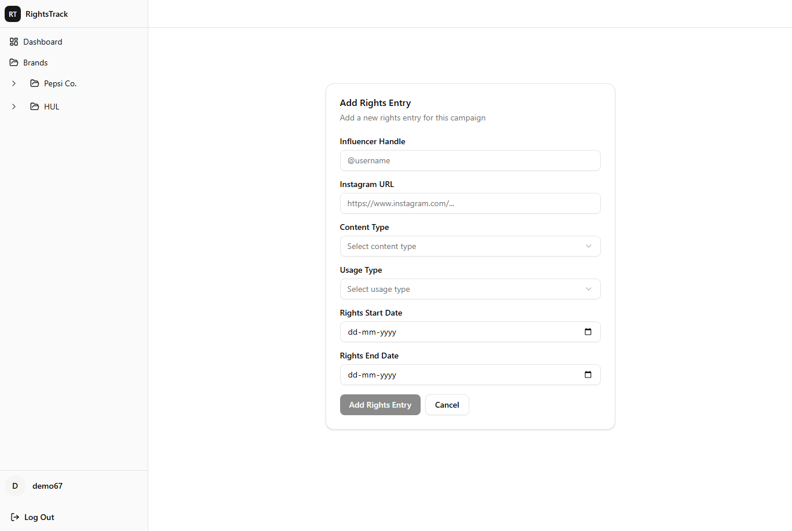

# RightsTracker

RightsTracker is a Next.js app for managing influencer rights and campaigns in one place so deal windows and renewals do not slip by unnoticed.

## Live demo

Currently live at -  [righto.curr.xyz](https://righto.curr.xyz)

## Preview



## Features

- Sign up and sign in with Supabase Auth
- Workspaces, projects, and campaigns to organize brands and deals
- Track rights and key dates per influencer / entry
- Scheduled email reminders when rights are nearing expiry (via Resend + Vercel cron)
- Optional demo login for local or staging (when enabled)

## Tech stack

- Next.js 16 (App Router)
- TypeScript + Tailwind CSS
- Supabase (Postgres, Auth, server client)
- Resend for email
- Radix UI + shadcn-style components, Framer Motion

## Prerequisites

Before you run the app locally, you will need:


- A **[Supabase](https://supabase.com)** project with Auth enabled and a database schema that matches the app (tables such as workspaces, projects, campaigns, and rights entries)
- A **[Resend](https://resend.com)** account and API key if you want expiry reminder emails to work (cron and manual tests both use it)
- For **scheduled** expiry emails in production, a host that can run the cron route (this project includes a Vercel cron entry in `vercel.json`; other platforms need an equivalent scheduler calling `/api/cron/check-expiry` with your `CRON_SECRET`)

## Local setup

1. Install dependencies:

```bash
cd my-app
npm install
```

1. Create `my-app/.env` with at least:

```bash
NEXT_PUBLIC_SUPABASE_URL=...
NEXT_PUBLIC_SUPABASE_ANON_KEY=...
SUPABASE_SERVICE_ROLE_KEY=...
RESEND_API_KEY=...
CRON_SECRET=...
```

Optional:

```bash
RESEND_FROM_EMAIL=RightsTrack <you@yourdomain.com>
NEXT_PUBLIC_DEMO_LOGIN_ENABLED=true
DEMO_LOGIN_ENABLED=true
DEMO_USER_EMAIL=...
DEMO_USER_PASSWORD=...
```

1. Run the dev server:

```bash
npm run dev
```

1. Open [http://localhost:3000](http://localhost:3000).

Cron (`/api/cron/check-expiry`) is configured in `vercel.json` for production; call it manually with `Authorization: Bearer <CRON_SECRET>` if you need to test expiry emails locally.
